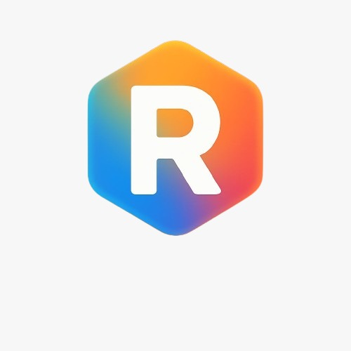

# Solana NFT Rewards System

A Next.js application that allows users to mint NFTs on the Solana blockchain, earn rewards through referrals, complete quests, and claim daily airdrops.

## Features

- **Phantom Wallet Integration**: Connect your Solana wallet securely
- **NFT Minting**: Mint exclusive NFTs for 10 USD equivalent in SOL
- **Referral System**: Earn rewards by referring friends
- **Quest System**: Complete tasks to earn points and unlock rewards
- **Daily Airdrop**: Claim a small amount of SOL daily to help with gas fees
- **Responsive Design**: Works on desktop and mobile devices

## Tech Stack

- **Frontend**: Next.js, React, TypeScript, Tailwind CSS
- **Blockchain**: Solana, Web3.js, SPL Token
- **Styling**: Tailwind CSS with custom theme
- **State Management**: React Context API

## Prerequisites

Before you begin, ensure you have the following installed:
- Node.js (v16 or later)
- npm or yarn
- [Phantom Wallet](https://phantom.app/) browser extension

## Installation

1. Clone the repository:
   \`\`\`bash
  (https://github.com/mirbhutto12/Reward-NFT-Web3-Project.git)
   cd solana-nft-rewards
   \`\`\`

2. Install dependencies:
   \`\`\`bash
   npm install
   # or
   yarn install
   \`\`\`

3. Create a `.env.local` file in the root directory with the following variables:
   \`\`\`
   NEXT_PUBLIC_SOLANA_RPC_URL=https://api.devnet.solana.com
   \`\`\`

4. Start the development server:
   \`\`\`bash
   npm run dev
   # or
   yarn dev
   \`\`\`

5. Open [http://localhost:3000](http://localhost:3000) in your browser to see the application.

## Usage

### Connecting Your Wallet

1. Click the "Connect Wallet" button in the navigation bar
2. Approve the connection request in your Phantom wallet
3. Once connected, your wallet address and SOL balance will be displayed

### Minting an NFT

1. Navigate to the "Mint" page
2. Ensure you have enough SOL in your wallet (equivalent to 10 USD)
3. Click the "Mint NFT" button
4. Approve the transaction in your Phantom wallet
5. Wait for the transaction to be confirmed
6. You'll be redirected to a success page once the NFT is minted

### Referral System

1. Navigate to the "Referrals" page
2. Copy your unique referral link
3. Share the link with friends
4. When someone mints an NFT using your referral link, you'll earn rewards

### Quests

1. Navigate to the "Quests" page
2. View available quests and their rewards
3. Complete quests to earn points
4. Points can be used to unlock special rewards

### Airdrop

1. Navigate to the "Airdrop" page
2. Click the "Claim Airdrop" button
3. Receive a small amount of SOL (0.01) to help with gas fees
4. Note that airdrops can only be claimed once every 24 hours

## Development

### Project Structure

\`\`\`
solana-nft-rewards/
├── app/                  # Next.js app directory
│   ├── airdrop/          # Airdrop page
│   ├── profile/          # User profile page
│   ├── quests/           # Quests page
│   ├── referrals/        # Referrals page
│   ├── success/          # Success page after minting
│   ├── globals.css       # Global styles
│   ├── layout.tsx        # Root layout
│   └── page.tsx          # Home page
├── components/           # React components
│   ├── ui/               # UI components
│   ├── wallet-provider.tsx # Wallet context provider
│   └── ...               # Other components
├── hooks/                # Custom React hooks
├── lib/                  # Utility functions
│   └── solana.ts         # Solana-related functions
├── public/               # Static assets
│   └── images/           # Images
├── .env.local            # Environment variables (create this)
├── next.config.js        # Next.js configuration
├── package.json          # Project dependencies
├── tailwind.config.js    # Tailwind CSS configuration
└── tsconfig.json         # TypeScript configuration
\`\`\`

### Customization

#### Changing the Theme

The theme colors are defined in `tailwind.config.js` and `app/globals.css`. You can modify these files to change the color scheme.

#### Adding New Quests

To add new quests, modify the `QuestsPage` component in `app/quests/page.tsx`.

#### Modifying NFT Minting Price

The NFT minting price is set to 10 USD equivalent in SOL. You can change this value in the `MintSection` component.

## Deployment

### Deploying to Vercel

1. Push your code to a GitHub repository
2. Import the repository in Vercel
3. Set the environment variables
4. Deploy

### Deploying to Other Platforms

Follow the standard Next.js deployment process for your chosen hosting platform.

## Solana Network Configuration

This application connects to the Solana devnet by default. The RPC URL is set to:

\`\`\`
NEXT_PUBLIC_SOLANA_RPC_URL=https://api.devnet.solana.com
\`\`\`

### Important Notes About Devnet

1. **Test Transactions**: All transactions on devnet involve test SOL and have no real financial consequences.
2. **Airdrops Available**: You can use the airdrop feature to get free test SOL for development and testing.
3. **Rate Limits**: Public RPC endpoints may have rate limits. For heavy testing, consider using a dedicated RPC provider.

### Switching to Mainnet for Production

When you're ready to deploy to production, you can switch to mainnet by changing the RPC URL in your `.env.local` file:

\`\`\`
NEXT_PUBLIC_SOLANA_RPC_URL=https://api.mainnet-beta.solana.com
\`\`\`

On mainnet, all transactions involve real SOL and have real financial consequences. The airdrop feature will not work on mainnet.
\`\`\`

## Security Considerations

- Never expose your private keys in the frontend code
- Use environment variables for sensitive information
- Implement proper error handling for blockchain transactions
- Consider using a backend service for sensitive operations

## Testing

### Running Tests

\`\`\`bash
npm test
# or
yarn test
\`\`\`

### Testing on Devnet

Before deploying to mainnet, thoroughly test your application on Solana devnet:

1. Make sure your `.env.local` file points to devnet
2. Use the airdrop feature to get test SOL
3. Test all functionality including minting, referrals, and quests

## Troubleshooting

### Common Issues

1. **Wallet Connection Issues**
   - Make sure Phantom wallet is installed
   - Try refreshing the page
   - Check if you're on the correct network (devnet/mainnet)

2. **Transaction Failures**
   - Ensure you have enough SOL for the transaction and gas fees
   - Check the Solana network status
   - Look at the browser console for error messages

3. **NFT Not Showing Up**
   - NFT metadata may take time to propagate
   - Check your wallet's NFT section
   - Verify the transaction on Solana Explorer

## Contributing

Contributions are welcome! Please feel free to submit a Pull Request.

1. Fork the repository
2. Create your feature branch (`git checkout -b feature/amazing-feature`)
3. Commit your changes (`git commit -m 'Add some amazing feature'`)
4. Push to the branch (`git push origin feature/amazing-feature`)
5. Open a Pull Request

## License

This project is licensed under the MIT License - see the LICENSE file for details.

## Acknowledgements

- [Solana](https://solana.com/)
- [Phantom Wallet](https://phantom.app/)
- [Next.js](https://nextjs.org/)
- [Tailwind CSS](https://tailwindcss.com/)

## Contact

If you have any questions or feedback, please reach out to us at example@rewardnft.com.

---

Built with ❤️ by the Reward NFT Team
